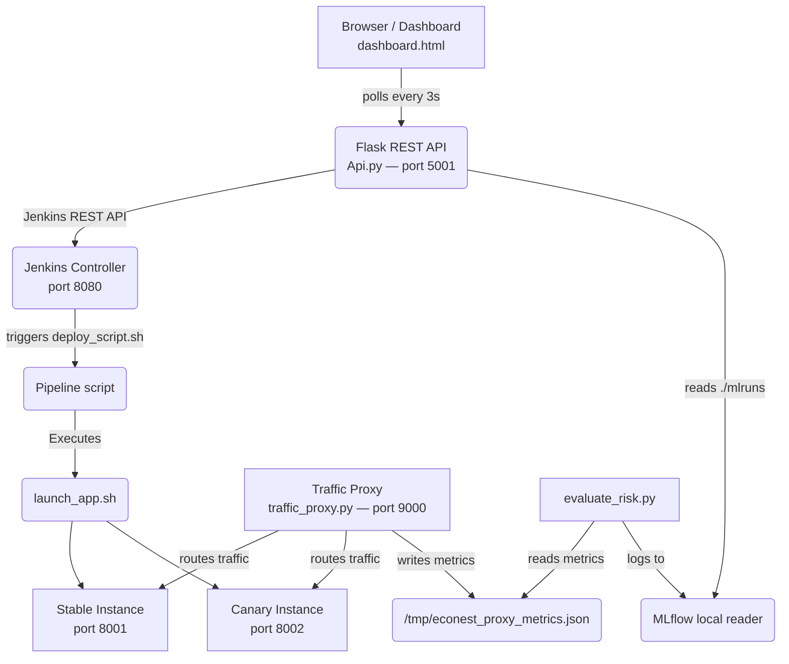

# Econest Canary Platform Architecture Specification

## 1. Component Overview


## 2. Repository File Structure
```
econest-canary-platform/
├── Jenkinsfile                  # Declarative pipeline — 10 stages
├── Api.py                       # Flask REST API — port 5001
├── dashboard.html               # Real-time SPA dashboard
├── launch_app.sh                # Universal app launcher (detects runtime)
├── traffic_proxy.py             # HTTP proxy — port 9000, weight-based split
├── deploy_script.sh             # Traffic weight controller + dashboard notifier
├── evaluate_risk.py             # MLflow risk scoring engine
├── verify_db_structure.py       # Pre-flight schema validation
└── requirements_api.txt         # flask, flask-cors, requests
```

## 3. Runtime Process Model
All components run as coordinated OS processes on a single macOS host. There is no Docker or virtualisation layer.

| Process | Port | PID File | Lifecycle |
| --- | --- | --- | --- |
| Api.py (Flask) | 5001 | manual | Started manually before demo. Persists across builds. |
| Jenkins Controller | 8080 | Jenkins | Persistent service. Manages all build processes. |
| traffic_proxy.py | 9000 | /tmp/econest_proxy.pid | Killed and restarted each build at Launch Proxy stage. |
| Stable App | 8001 | /tmp/econest_stable.pid | Started at Launch Stable. Killed on 100% promotion or rollback. |
| Canary App | 8002 | /tmp/econest_canary.pid | Started at Launch Canary. Becomes sole process after 100% promotion. |

## 4. Traffic Splitting Logic
The proxy reads the weight file on every request and makes a probabilistic routing decision using a uniform random integer in [1, 100]. Routing is per-request, not session-sticky.

```python
weight = int(read('/tmp/econest_traffic_weight'))   # 0 | 10 | 50 | 100

if weight > 0 and randint(1, 100) <= weight:
    forward_request(CANARY_PORT=8002)   # canary cohort
else:
    forward_request(STABLE_PORT=8001)   # stable cohort
```

## 5. Risk Scoring Thresholds
```python
LATENCY_THRESHOLD   = 500.0   # ms  — canary P95 response time
ERROR_RATE_THRESHOLD = 0.05   # 5%  — canary HTTP 5xx rate

ABORT   if canary_latency_p95 > LATENCY_THRESHOLD
        OR canary_error_rate  > ERROR_RATE_THRESHOLD

PROMOTE otherwise
```

Fallback to simulation if:
- proxy metrics file does not exist
- proxy has < 5 canary requests
- metrics are stale (written > 120 seconds ago)

## 6. API Endpoints
| Method | Endpoint | Description |
| --- | --- | --- |
| GET | /api/health | Liveness check. Dashboard polls to show API ONLINE / OFFLINE pill. |
| POST | /api/deploy | Triggers Jenkins build with REPO_URL param. Adds entry to local SQLite history. |
| GET | /api/status | Returns current Jenkins build state: building, result, number, stages[] from wfapi. |
| GET | /api/metrics | Reads ./mlruns directory tree and returns all MLflow run metrics and params. |
| GET | /api/history | Returns persistent deployment history from SQLite database. |
| POST | /api/rollback | Triggers Jenkins build with FORCE_ROLLBACK=true. Bypasses all validation stages. |
| GET | /api/console | Returns last 200 lines of Jenkins console output for the most recent build. |
| POST | /api/update | Receives stage progress notifications from deploy_script.sh. |

## 7. Key Data Flows

### Happy Path — Full Deployment
1. User enters GitHub URL in dashboard and clicks Deploy
2. Dashboard POSTs {repo_url} to `/api/deploy`
3. Api.py calls Jenkins `/buildWithParameters` with REPO_URL param
4. Jenkins: Checkout — clones repo into workspace
5. Jenkins: Install Dependencies — pip3 installs platform requirements
6. Jenkins: Verify DB Structure — runs `verify_db_structure.py` (exit 0)
7. Jenkins: Launch Stable — `launch_app.sh` detects runtime, starts app on port 8001
8. Jenkins: Launch Proxy — `traffic_proxy.py` starts on port 9000, weight file set to 0
9. Jenkins: Launch Canary — `launch_app.sh` starts second instance on port 8002
10. Jenkins: Canary 10% — `deploy_script.sh` writes '10' to weight file, 10 warm-up requests
11. Jenkins: Evaluate Risk — `evaluate_risk.py` reads proxy metrics, logs to MLflow, exits 0 (PROMOTE)
12. Jenkins: Promote 50% — `deploy_script.sh` writes '50', 20 test requests
13. Jenkins: Promote 100% — writes '100', stable process killed, smoke test passes
14. Dashboard polls `/api/status` every 3s — 7 stage bubbles light up green, traffic card shows 100%

### Risk Rollback — Threshold Breach
15. `evaluate_risk.py` reads proxy metrics: canary error_rate = 0.07 (> 0.05 threshold)
16. MLflow logs: decision=ABORT, abort_reason='error rate 0.070 > 0.05 threshold'
17. `evaluate_risk.py` exits with code 1
18. Jenkins marks Evaluate Risk stage FAILED
19. `post{failure}` fires — runs `deploy_script.sh 0`
20. `deploy_script.sh` writes '0' to weight file — proxy routes 100% to stable
21. Canary process killed via `/tmp/econest_canary.pid`
22. Jenkins build marked FAILED with timestamp in dashboard history
23. Dashboard: red bubble on Risk Score, traffic drops to 0%

### Emergency Rollback — Operator Initiated
24. Operator clicks Rollback Now in dashboard
25. confirm() dialog — operator confirms
26. Dashboard POSTs to `/api/rollback`
27. Api.py triggers Jenkins build with FORCE_ROLLBACK=true
28. Rollback Gate fires immediately, all other stages skipped
29. `deploy_script.sh 0` runs — weight file set to 0, canary process killed
30. Jenkins marks build FAILED (intentional, for audit trail integrity)
31. Dashboard history shows ROLLBACK entry with timestamp


## 8. V3 Upgrades
In Version 3, the architecture implements Docker isolation for all deployed applications, eliminating bare-metal dependency conflicts. It also utilizes Session-Sticky routing via the `Econest-Cohort` cookie and implements real-time WebSocket communication for the dashboard using Flask-SocketIO.


## 9. Frontend Architecture
The frontend is a distinct Node.js process running a Vite React application. It connects to the Python API over HTTP for actions, and WebSockets for real-time telemetry streaming.
